## Descrierea eșantionului de elevi

Eșantionul studiului include o distribuție aproape egală între sexe, cu o ușoară predominanță a persoanelor de sex feminin, care reprezintă 50.8% din totalul respondenților, adică 334 de persoane. Participanții de sex masculin constituie 48.6% din eșantion, ceea ce înseamnă 319 persoane, iar un procent foarte mic, de doar 0.6% (4 persoane), nu au furnizat informații despre sex.

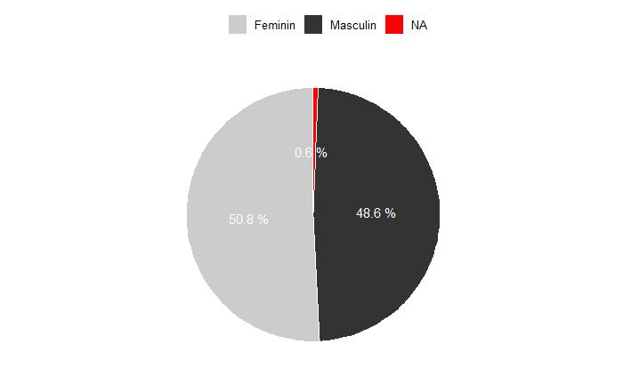

Din perspectiva vârstei, cele mai reprezentative grupe sunt cele de 16 și 17 ani, care însumează majoritatea participanților. Respondenții de 16 ani reprezintă 35.31% din eșantion, adică 232 de persoane, iar cei de 17 ani constituie 36.07%, adică 237 de persoane. În ceea ce privește alte grupe de vârstă, persoanele de 14 ani sunt aproape absente, fiind reprezentate de un singur respondent (0.15%), iar cele de 15 ani constituie un procent de 4.41%, adică 29 de persoane. La polul opus, respondenții de 18 ani reprezintă 20.85%, adică 137 de persoane.

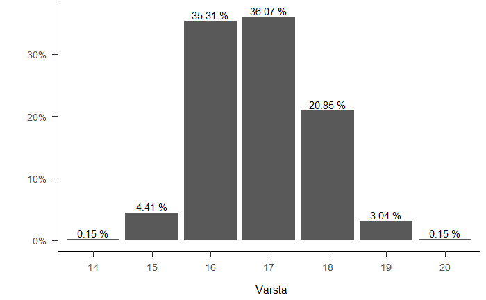

Eșantionul utilizat a prezentat un echilibru adecvat al genurilor pe categorii de vârsta.

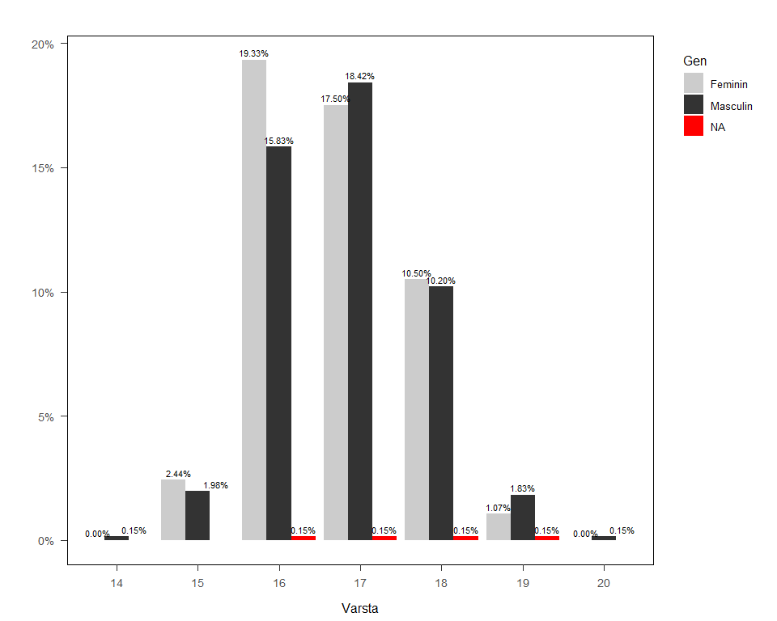

În ceea ce privește mediul de rezidență, majoritatea respondenților, respectiv 62.3% (409 persoane), provin din mediul rural, în timp ce 37.7% (248 persoane) provin din mediul urban. Această preponderență a respondenților din mediul rural este intenționată, având în vedere că studiul se concentrează pe sănătatea mintală și reziliența academică a grupurilor vulnerabile, iar populațiile din mediul rural sunt adesea mai expuse riscurilor legate de accesul limitat la resurse educaționale și servicii de suport psihologic.

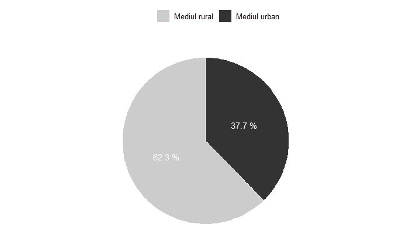

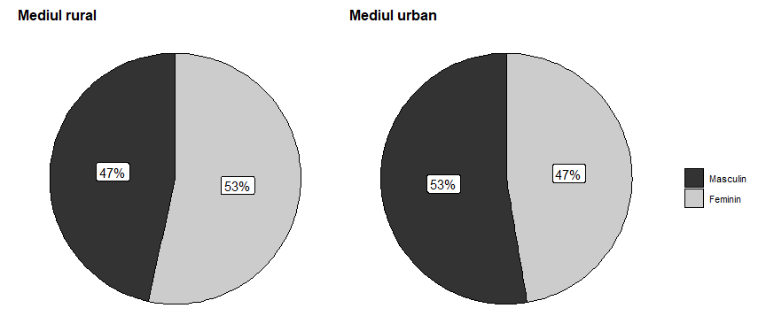

În concluzie, eșantionul este bine echilibrat în ceea ce privește sexul participanților, dar există o preponderență clară a persoanelor din mediul rural. Această alegere este justificată de focusul studiului pe grupurile vulnerabile, deoarece tinerii din mediul rural întâmpină mai frecvent dificultăți în accesarea resurselor necesare pentru o bună sănătate mintală și succes academic. Din punct de vedere al vârstei, studiul se concentrează pe adolescenți, în special pe cei cu vârste de 16 și 17 ani, o categorie crucială pentru investigarea rezilienței academice și a dezvoltării personale, întrucât acești ani sunt definitorii pentru formarea viitoarelor direcții educaționale și profesionale.

## Factori de risc

Graficul următor ilustrează răspunsurile participanților referitoare la implicarea lor în comportamente de risc. Observăm o prevalență diferită pentru fiecare dintre cele trei întrebări analizate. Pentru consumul de băuturi alcoolice (bere, vin, tărie), 71% dintre respondenți au răspuns negativ, indicând că nu au consumat astfel de substanțe, în timp ce 29% au raportat un comportament pozitiv (consum). Acest lucru sugerează că aproape o treime dintre respondenți s-au angajat în acest comportament de risc, o proporție semnificativă pentru analiza intervențiilor preventive. În ceea ce privește consumul de tutun, sau alte forme de tabac, 75% au declarat că nu au fumat, însă 25% au răspuns afirmativ. Această proporție relevă o expunere notabilă la acest risc, în special având în vedere efectele negative asupra sănătății. Pentru întrebarea legată de utilizarea medicamentelor fără prescripție medicală sau a altor droguri ilegale (cum ar fi marijuana, cocaina, ecstasy sau inhalanții), 95% dintre respondenți au răspuns că nu s-au angajat în astfel de comportamente. Doar 5% au raportat consumul, ceea ce indică o prevalență scăzută a acestui risc comparativ cu celelalte comportamente analizate. În concluzie, Figura 1 evidențiază că, deși majoritatea respondenților nu se angajează în comportamente de risc, există o proporție semnificativă pentru consumul de alcool și tutun care merită atenție suplimentară în contextul programelor de prevenție. Consumul de droguri și medicamente fără prescripție medicală are o prevalență mult mai redusă, dar acest comportament rămâne important pentru intervențiile de educare și reducere a riscurilor.

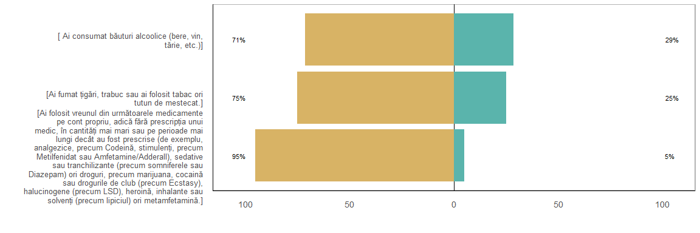

Următorul prezintă răspunsurile participanților la un set de întrebări care explorează frecvența cu care aceștia experimentează diferite simptome sau comportamente. Aceste întrebări sunt relevante pentru identificarea unor dificultăți emoționale, psihologice sau comportamentale și măsoară aspecte precum stările de anxietate, depresie, tulburări de somn, preocupări obsesive, sau simptome de tip compulsiv.

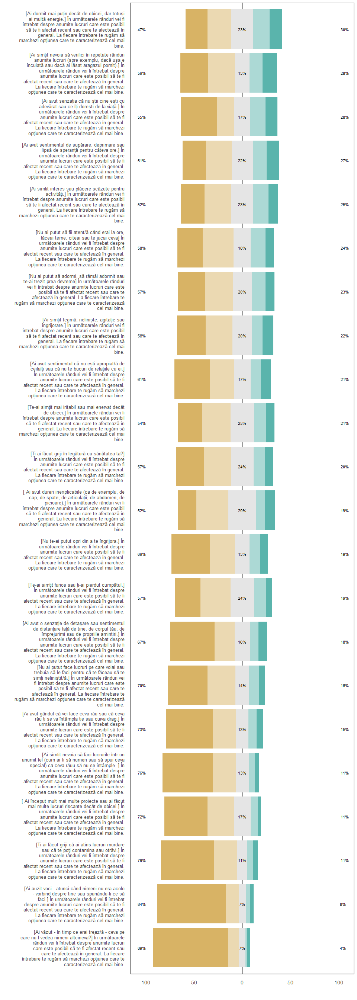

Majoritatea respondenților au raportat că aceste simptome sau comportamente nu sunt frecvent întâlnite în viața lor de zi cu zi. De exemplu, un procent semnificativ, cuprins între 70% și 89%, a declarat că nu au experimentat deloc sau aproape niciodată comportamente precum auzul unor voci, senzația de contaminare sau murdărire, sau nevoia de a face lucrurile într-un anumit fel pentru a evita anxietatea. Pe de altă parte, procentele asociate cu răspunsurile "aproape întotdeauna" sau "zilnic" sunt foarte scăzute, oscilând între 4% și 15%, ceea ce sugerează că doar o minoritate a participanților prezintă astfel de simptome într-o manieră frecventă. Un aspect interesant este frecvența mai ridicată raportată pentru anumite simptome emoționale precum sentimentul de tristețe sau dificultăți de somn. În aceste cazuri, aproximativ 20-30% dintre respondenți au indicat că experimentează aceste probleme cel puțin ocazional. Acest lucru sugerează că aceste simptome ar putea fi mai comune comparativ cu alte manifestări evaluate în grafic. În general, rezultatele arată că, deși majoritatea respondenților nu prezintă simptome frecvente sau severe, există o mică parte a eșantionului care poate beneficia de suport suplimentar pentru a gestiona dificultăți emoționale și comportamentale.

## Simptomatologie și dificultăți psihologice

În cazul simptomatologiei ADHD, cele mai frecvente scoruri se regăsesc în intervalele moderate spre ridicate (15-20, 28.04%) și ridicate (20-25, 24.35%), indicând o concentrare în jurul severității moderate. Scorurile foarte mici (5-10, 8.86%) și extrem de ridicate (30-35, 6.27%) sunt mai puțin frecvente.

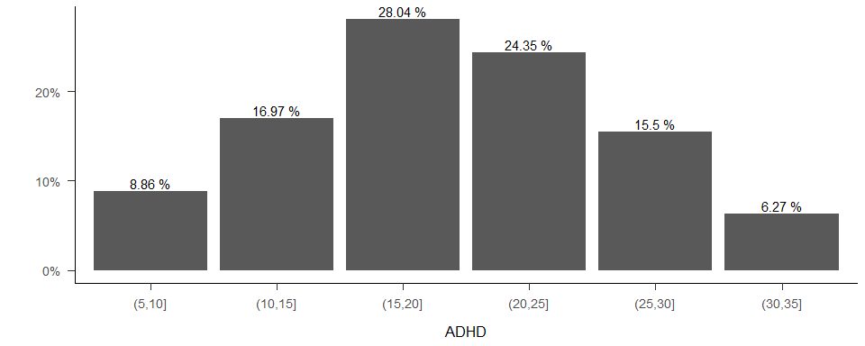

Pentru depresie, majoritatea participanților prezintă scoruri sub pragul cut-off (12), cele mai frecvente fiind în intervalele 8-10 (16.09%), 6-8 (14.48%) și 4-6 (13.79%). Scorurile ridicate, peste 14, sunt mai rare, cele extrem de ridicate (22-28) având proporții sub 3%.

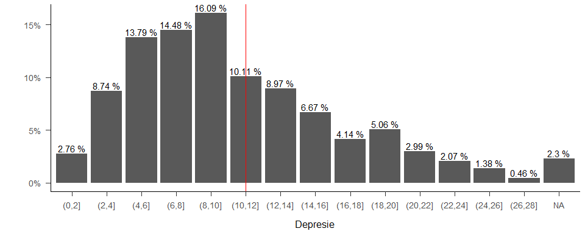

La anxietatea generalizată, cele mai frecvente scoruri sunt aproape de pragul cut-off (6-8, 17.15%; 8-10, 15.41%), iar scorurile ridicate și severe (peste 16) sunt mai puțin frecvente, sub 5%.

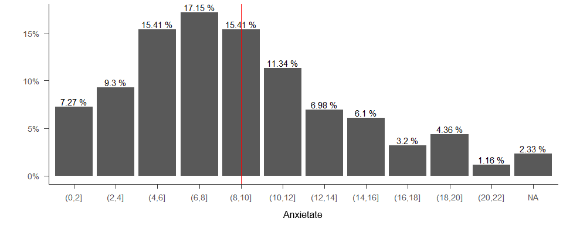

În anxietatea socială, majoritatea respondenților au scoruri sub cut-off, cele mai frecvente intervale fiind 5-10 (27.11%) și 10-15 (17.49%). Scorurile severe (peste 25) sunt rare, cele mai ridicate având proporții sub 3%.

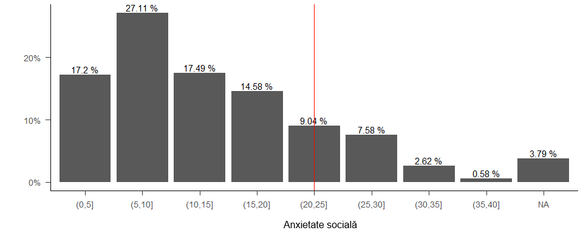

Rezultatele indică faptul că majoritatea adolescenților din acest eșantion din România prezintă simptome ușoare sau moderate de sănătate mintală, cu prevalențe mai reduse ale simptomelor severe. În cazul ADHD, depresiei și anxietății generalizate, cei mai mulți participanți au scoruri sub pragurile cut-off, ceea ce sugerează că simptomele nu sunt semnificative clinic pentru majoritatea. Totuși, există segmente considerabile ale populației care depășesc aceste praguri, în special în cazul depresiei și anxietății, unde o proporție semnificativă prezintă simptome moderate sau severe. În ceea ce privește anxietatea socială, scorurile severe sunt rare, dar există un procent semnificativ de adolescenți care raportează simptome ușoare sau moderate. Aceste date subliniază importanța intervențiilor preventive și a sprijinului psihologic, în special pentru adolescenții care prezintă simptome semnificative, dar și necesitatea monitorizării și sprijinirii sănătății mintale în ansamblu pentru această categorie vulnerabilă.
